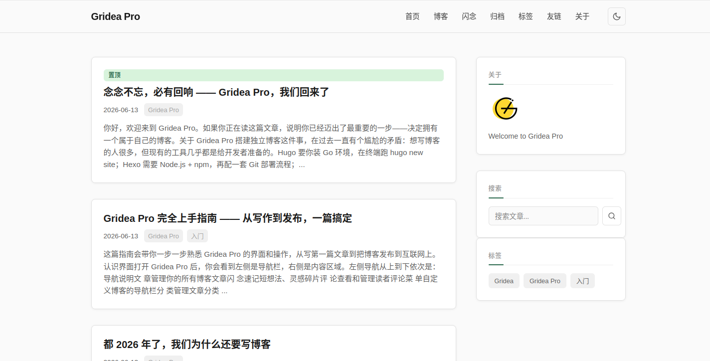

# Earth

> 均衡通用的经典博客主题 · 色彩中性、模板完整、适合各类博客场景。Earth 以森林绿为强调色，追求内容可读性与视觉舒适度的完美平衡。

## 信息

| 字段 | 值 |
|---|---|
| 目录名 | `earth` |
| 版本 | `1.0.0` |
| 作者 | seolcho0827 |
| 模板引擎 | `jinja2` (Pongo2) |

## 特色

- **均衡通用** — 中性色调搭配森林绿强调色，适合各类博客类型
- **作者简介** — 文章底部展示作者信息，增强个人品牌
- **阅读时间预估** — 自动计算文章阅读时长
- **社交分享按钮** — 圆形图标按钮，方便读者分享内容
- **大圆角设计** — 卡片采用 16px / 64px 柔和圆角，视觉效果更精致
- **宽松排版** — 充足留白、舒适行距，提升阅读体验
- **明暗双主题** — 暗色模式采用深蓝紫底色，护眼舒适
- **响应式布局** — 完美适配桌面、平板、手机三端
- **灵活布局** — 右侧侧边栏 / 全宽无侧边栏可切换
- **完整的页面覆盖** — 首页、文章详情、归档、标签、标签云、分页博客列表、404

## 自定义参数

在应用「主题 → 自定义」里可以配置以下选项：

### 外观设置

| 参数 | 说明 | 默认值 |
|---|---|---|
| 强调色 | 链接、按钮等主要元素的颜色 | `#2d6a4f` |
| 显示暗色模式切换 | - | `true` |

### 布局设置

| 参数 | 说明 | 默认值 |
|---|---|---|
| 页面布局 | 右侧侧边栏 / 全宽无侧边栏 | `right-sidebar` |
| 显示侧边栏 | - | `true` |

### 文章设置

| 参数 | 说明 | 默认值 |
|---|---|---|
| 文章底部显示作者简介 | - | `true` |
| 显示预估阅读时间 | - | `true` |
| 显示社交分享按钮 | - | `true` |
| 文章底部显示标签 | - | `true` |
| 显示上下篇导航 | - | `true` |
| 每页文章数 | 首页和博客列表每页显示的文章数量 | `10` |

### 社交设置

| 参数 | 说明 | 默认值 |
|---|---|---|
| GitHub 用户名 | - | `` |
| Twitter 用户名 | - | `` |

### 基础设置

| 参数 | 说明 | 默认值 |
|---|---|---|
| 页脚自定义文字 | 留空则自动显示 © 年份 站点名 | `` |

### 高级设置

| 参数 | 说明 | 默认值 |
|---|---|---|
| 自定义 CSS | 追加到主样式后面 | `` |

## 使用

1. 在 Gridea Pro 应用内「主题」页选择本主题
2. 在「自定义」里按需调整参数
3. 预览、发布

## 授权

[CC BY-NC-SA 4.0](https://creativecommons.org/licenses/by-nc-sa/4.0/)

本主题采用 **Creative Commons Attribution-NonCommercial-ShareAlike 4.0 International** 许可协议。

- **署名（BY）** — 使用时必须注明原作者
- **非商业性使用（NC）** — 不得将本主题用于商业目的
- **相同方式共享（SA）** — 修改后的衍生作品必须以相同协议发布
