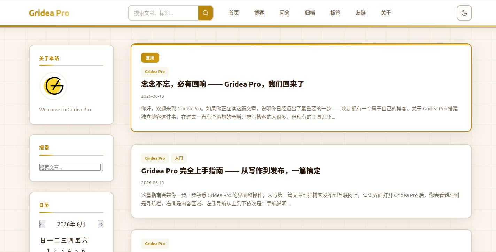

# Jupiter

> 功能丰富的重型博客主题 · 多侧边栏组件、目录树、相关文章、社交集成

## 信息

| 字段 | 值 |
|---|---|
| 目录名 | `jupiter` |
| 版本 | `1.0.0` |
| 作者 | seolcho0827 |
| 模板引擎 | `jinja2` (Pongo2) |

## 特色

- 紫金配色，高贵典雅
- 多侧边栏小组件（关于、标签、社交、近期文章）
- 文章目录树（Table of Contents），支持深度配置
- 相关文章网格
- 近期文章列表侧边栏组件
- 上下篇导航
- 明暗色切换（localStorage 持久化）
- 更宽页面布局（1320px），内容饱满
- 自定义 JavaScript 支持
- 响应式布局（Mobile First）

## 自定义参数

### 外观设置

| 参数 | 类型 | 默认值 | 说明 |
|---|---|---|---|
| `accentColor` | input | `#7209b7` | 链接、按钮等元素的强调颜色 |
| `showDarkModeToggle` | toggle | `true` | 显示暗色模式切换按钮 |

### 布局设置

| 参数 | 类型 | 默认值 | 说明 |
|---|---|---|---|
| `layout` | select | `right-sidebar` | 页面布局（右侧侧边栏/全宽无侧边栏） |
| `showSidebar` | toggle | `true` | 显示侧边栏 |

### 文章设置

| 参数 | 类型 | 默认值 | 说明 |
|---|---|---|---|
| `showTableOfContents` | toggle | `true` | 文章页显示目录 |
| `tocDepth` | select | `h3` | 目录深度（h2/h3/h4） |
| `showRelatedPosts` | toggle | `true` | 显示相关文章 |
| `showRecentPosts` | toggle | `true` | 侧边栏显示近期文章 |
| `showTagsInPost` | toggle | `true` | 文章底部显示标签 |
| `showPostNav` | toggle | `true` | 显示上下篇导航 |
| `postsPerPage` | input | `10` | 每页文章数 |

### 社交设置

| 参数 | 类型 | 默认值 | 说明 |
|---|---|---|---|
| `socialGithub` | input | (空) | GitHub 用户名 |
| `socialTwitter` | input | (空) | Twitter 用户名 |
| `socialEmail` | input | (空) | Email 地址 |

### 基础设置

| 参数 | 类型 | 默认值 | 说明 |
|---|---|---|---|
| `footerText` | input | (空) | 页脚自定义文字 |

### 高级设置

| 参数 | 类型 | 默认值 | 说明 |
|---|---|---|---|
| `customCSS` | textarea | (空) | 自定义 CSS |
| `customJS` | textarea | (空) | 自定义 JavaScript |

## 使用

1. In Gridea Pro, go to 主题管理 → 导入主题 → 选择 `jupiter` 目录
2. 在主题设置中调整各项参数
3. 确保站点域名已正确配置，主题依赖域名加载 CSS 等资源

## 授权

[CC BY-NC-SA 4.0](https://creativecommons.org/licenses/by-nc-sa/4.0/)
