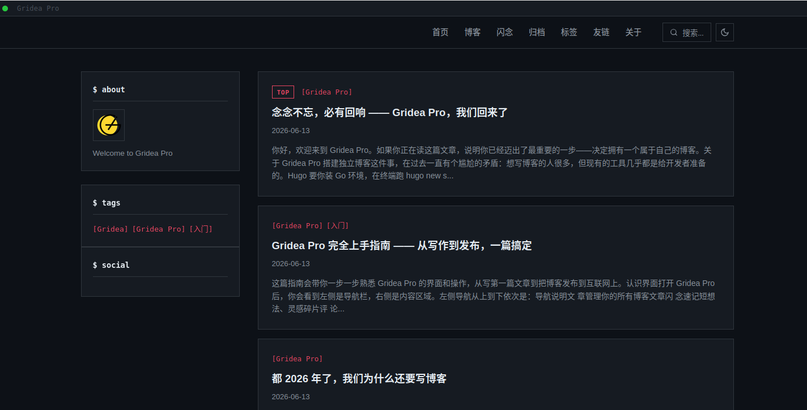

# Mars

> 硬核暗色优先的技术博客主题 · 默认暗色模式、等宽字体点缀、开发者风格

## 信息

| 字段 | 值 |
|---|---|
| 目录名 | `mars` |
| 版本 | `1.0.0` |
| 作者 | seolcho0827 |
| 模板引擎 | `jinja2` (Pongo2) |

## 特色

- 默认深色模式，终端美学设计
- 等宽字体点缀（SF Mono / Fira Code），代码氛围浓厚
- 仿终端信号灯装饰点（红/黄/绿）
- 代码块复制按钮
- 文章目录（Table of Contents）
- 明暗色切换（localStorage 持久化）
- 响应式布局（Mobile First）
- 自定义强调色、布局、侧边栏等丰富配置

## 自定义参数

### 外观设置

| 参数 | 类型 | 默认值 | 说明 |
|---|---|---|---|
| `accentColor` | input | `#e94560` | 链接、代码高亮等元素的强调颜色 |
| `defaultTheme` | select | `dark` | 默认主题模式（深色/浅色） |
| `showDarkModeToggle` | toggle | `true` | 显示暗色模式切换按钮 |

### 功能设置

| 参数 | 类型 | 默认值 | 说明 |
|---|---|---|---|
| `showCodeCopy` | toggle | `true` | 代码块显示复制按钮 |
| `showTableOfContents` | toggle | `true` | 文章页显示目录 |

### 布局设置

| 参数 | 类型 | 默认值 | 说明 |
|---|---|---|---|
| `layout` | select | `right-sidebar` | 页面布局（右侧侧边栏/全宽无侧边栏） |
| `showSidebar` | toggle | `true` | 显示侧边栏 |

### 文章设置

| 参数 | 类型 | 默认值 | 说明 |
|---|---|---|---|
| `postsPerPage` | input | `10` | 每页文章数 |
| `showTagsInPost` | toggle | `true` | 文章底部显示标签 |

### 社交设置

| 参数 | 类型 | 默认值 | 说明 |
|---|---|---|---|
| `socialGithub` | input | (空) | GitHub 用户名 |
| `socialTwitter` | input | (空) | Twitter 用户名 |

### 基础设置

| 参数 | 类型 | 默认值 | 说明 |
|---|---|---|---|
| `footerText` | input | (空) | 页脚自定义文字 |

### 高级设置

| 参数 | 类型 | 默认值 | 说明 |
|---|---|---|---|
| `customCSS` | textarea | (空) | 自定义 CSS |

## 使用

1. In Gridea Pro, go to 主题管理 → 导入主题 → 选择 `mars` 目录
2. 在主题设置中调整各项参数
3. 确保站点域名已正确配置，主题依赖域名加载 CSS 等资源

## 授权

[CC BY-NC-SA 4.0](https://creativecommons.org/licenses/by-nc-sa/4.0/)
