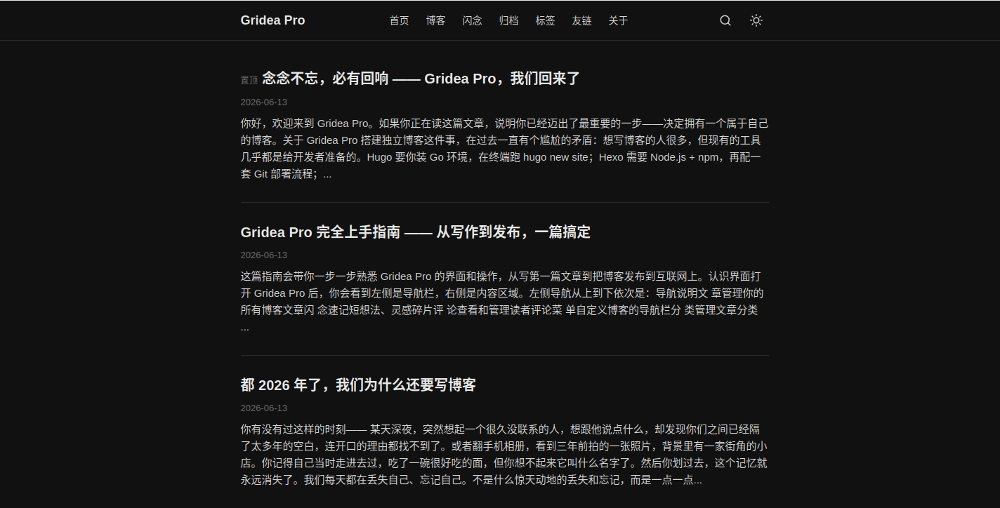

# Mercury

> 极简内容优先的博客主题 · 太阳系行星系列首作。Mercury 追求轻量快速，以内容为核心，去除冗余装饰，提供沉浸式阅读体验。

## 信息

| 字段 | 值 |
|---|---|
| 目录名 | `mercury` |
| 版本 | `1.0.0` |
| 作者 | seolcho0827 |
| 模板引擎 | `jinja2` (Pongo2) |

## 特色

- **极简设计** — 内容优先，去除冗余装饰，加载最快
- **明暗双主题** — 跟随系统偏好或手动切换，防闪避策略
- **响应式布局** — 完美适配桌面、平板、手机三端
- **灵活布局** — 右侧侧边栏 / 全宽无侧边栏可切换
- **毛玻璃导航** — 固定顶栏配合 backdrop-filter 毛玻璃效果
- **完整的页面覆盖** — 首页、文章详情、归档、标签、标签云、分页博客列表、404

## 自定义参数

在应用「主题 → 自定义」里可以配置以下选项：

### 外观设置

| 参数 | 说明 | 默认值 |
|---|---|---|
| 主题色 | 链接、按钮等主要元素的颜色 | `#3b82f6` |
| 显示暗色模式切换 | - | `true` |

### 布局设置

| 参数 | 说明 | 默认值 |
|---|---|---|
| 页面布局 | 右侧侧边栏 / 全宽无侧边栏 | `right-sidebar` |
| 显示侧边栏 | - | `true` |

### 文章设置

| 参数 | 说明 | 默认值 |
|---|---|---|
| 每页文章数 | 首页和博客列表每页显示的文章数量 | `10` |
| 文章底部显示标签 | - | `true` |
| 显示上下篇导航 | - | `true` |

### 社交设置

| 参数 | 说明 | 默认值 |
|---|---|---|
| GitHub 用户名 | - | `` |
| Twitter 用户名 | - | `` |

### 基础设置

| 参数 | 说明 | 默认值 |
|---|---|---|
| 页脚自定义文字 | 留空则自动显示 © 年份 站点名 | `` |

### 高级设置

| 参数 | 说明 | 默认值 |
|---|---|---|
| 自定义 CSS | 追加到主样式后面 | `` |

## 使用

1. 在 Gridea Pro 应用内「主题」页选择本主题
2. 在「自定义」里按需调整参数
3. 预览、发布

## 授权

[CC BY-NC-SA 4.0](https://creativecommons.org/licenses/by-nc-sa/4.0/)

本主题采用 **Creative Commons Attribution-NonCommercial-ShareAlike 4.0 International** 许可协议。

- **署名（BY）** — 使用时必须注明原作者
- **非商业性使用（NC）** — 不得将本主题用于商业目的
- **相同方式共享（SA）** — 修改后的衍生作品必须以相同协议发布
